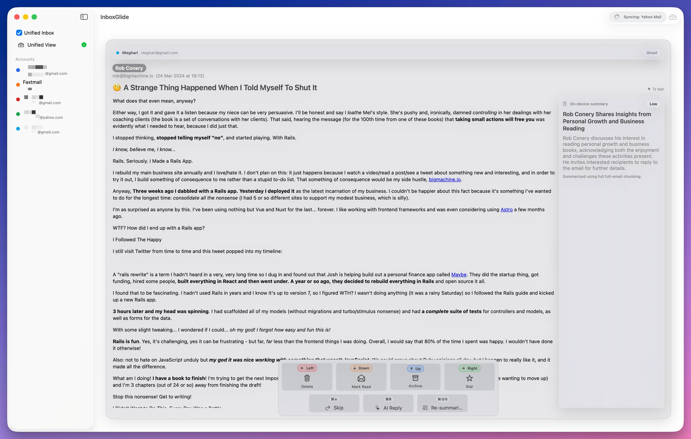

# InboxGlide (macOS)

InboxGlide is a macOS SwiftUI app prototype for processing email as a card deck: glide (swipe) a message left/right/up/down to apply an action.



- Card-based inbox with trackpad/mouse drag gestures
- Keyboard glides (arrow keys)
- On-screen action buttons
- Customizable glide mappings (primary + Option/Alt secondary)
- Multi-account + optional unified inbox
- Local encrypted store (AES-GCM; key stored in macOS Keychain)
- AI quick reply (local stub) with local PII scrubbing (Coming soon...)
- Email summary with on-device Foundation Models support and local fallback
- Optional daily reminder notifications (Coming soon...)
- Data export + delete-all
- **Production-ready provider integrations:**
  - Gmail OAuth + inbox sync
  - Yahoo app-password onboarding + IMAP inbox sync
  - Fastmail app-password onboarding + IMAP inbox sync

## Requirements

- macOS 14+
- Xcode 15+ (or newer) with Command Line Tools (`xcodebuild`)

## Install (build + copy to ~/Applications)

From Terminal:

```bash
cd inbox-glide
chmod +x install.command
./install.command
```

Or double-click `inbox-glide/install.command` in Finder (it must be executable).

The script builds a Release app and installs it to `~/Applications/InboxGlide.app`.

## Notes

- Data is stored under `~/Library/Application Support/InboxGlide/` and encrypted at rest.
- Notifications and Reminders require macOS permission prompts when you enable/use them.
